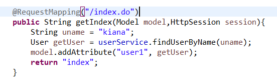
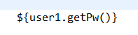
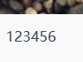
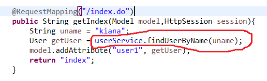
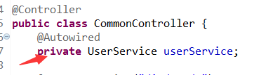
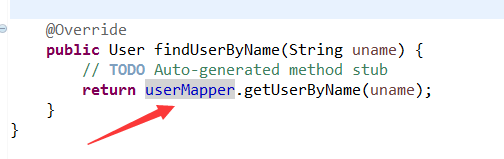
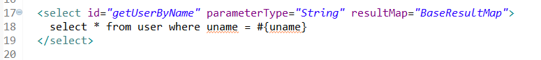

# E-shop
--------------------------
## 简单上手教程
* ``目标：根据用户名，从数据库中取出用户，在前端打印密码``
* ``步骤如下：``

1. 假设我们要取用户名为kiana的用户，在CommonController.java如下：

 ```
 注意此时的路由为/index.do
 接下来转到 index.jsp 文件
 ```

```
在jsp文件中引入User实体类包
```

```
使用实体类的 get 方法
前端效果如下：
```

```
可以看到，用户 kiana 的密码在前端被正确的打印了出来
```

2. 服务类的编写
```
这里有个问题，在CommonController.java文件中的userService.findUserByName()怎么来的?
```

```
从CommonController.java的私有成员可以看出，答案应该在服务类中去找
如下图：
```

```
通过服务类的接口和实现文件可以发现，
他们引用了UserMapper文件
```

```
继续追根溯源，找到了UserMapper.java，发现这是一个接口文件！
那么，到底是什么东西在操作数据库，想必你已经明白了！
```

```
最终，我们在UserMapper.xml文件中找到了SQL语句的实现
至此，根据用户名，从数据库中取出用户，在前端打印密码 的功能完全实现了！
```
